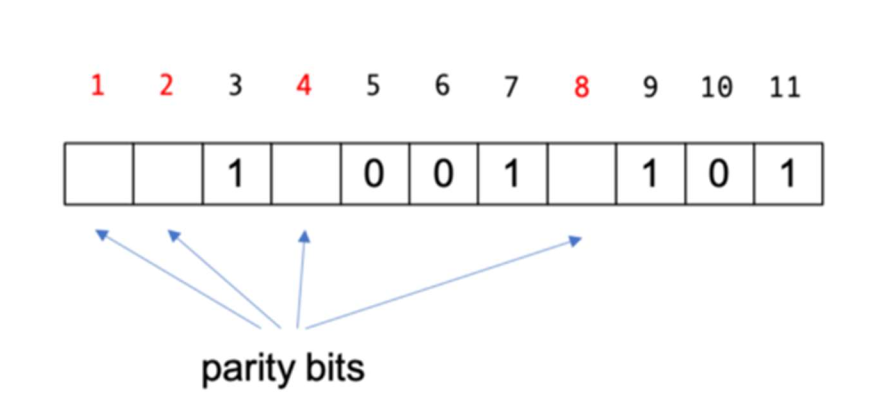
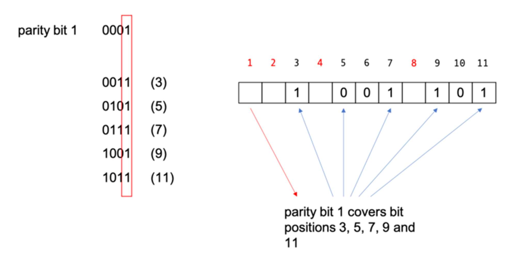
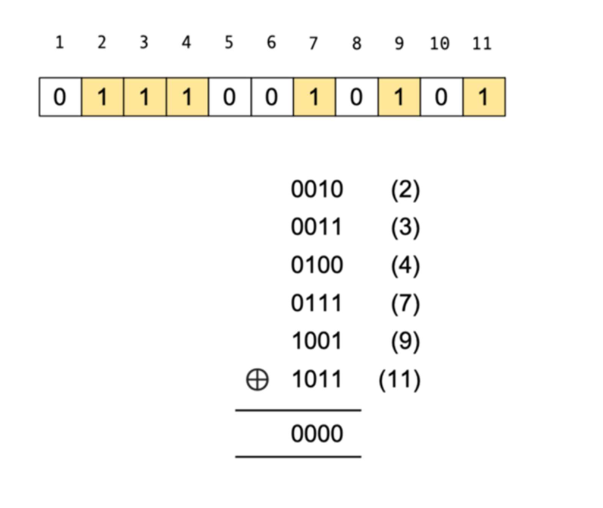
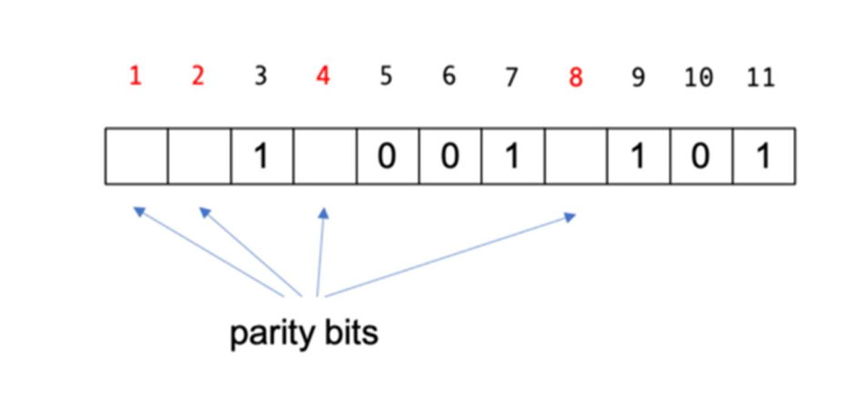
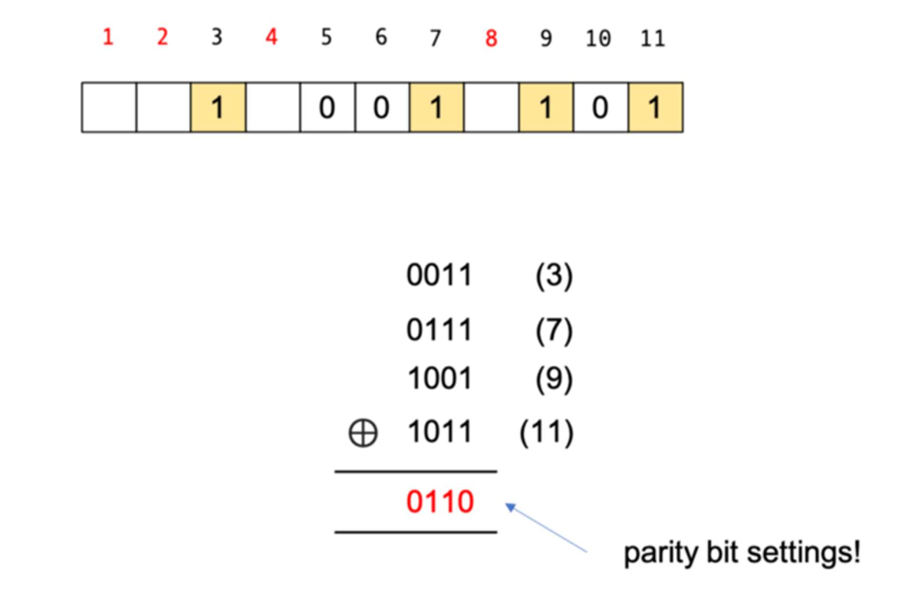
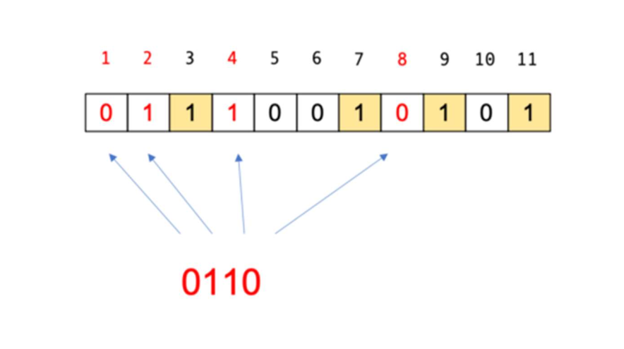
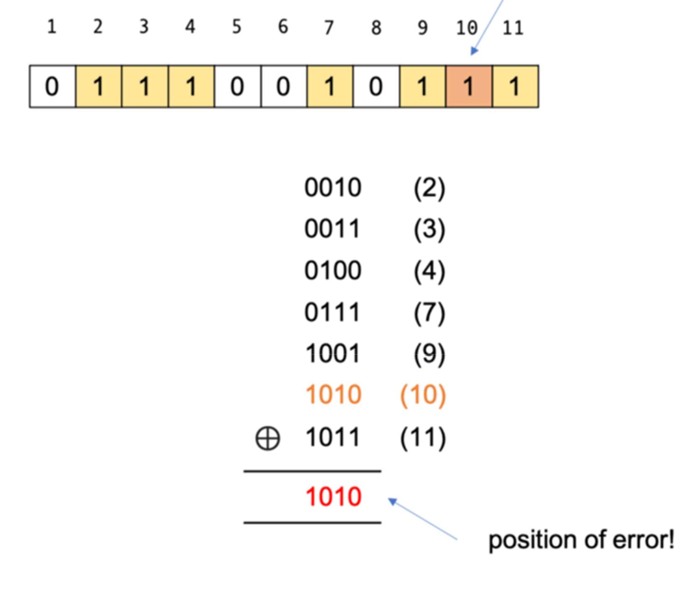
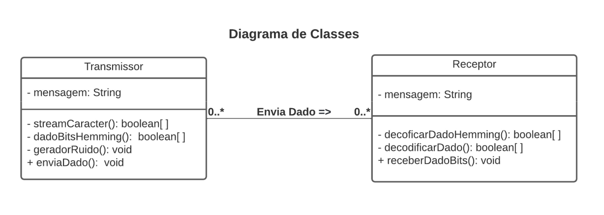

<h1 align="center"> Transmissão de Dados Utilizando Código Hamming </h1>

	<a href="#about">Introdução</a> |
	<a href="#hamming-code">Código de Hamming</a> |
	<a href="#implementation">Implementação</a> |
    <a href="#references">Referências</a> |
	<a href="#author">Autor</a>

<h2 id="about">💡&nbsp; Introdução </h2>

No contexto da transmissão de dados entre um transmissor e um receptor, a mensagem transmitida possui possibilidade de chegar ao seu determinado receptor com algum ruído (alteração de alguma das características do sinal transmitido). Dessa forma, surge a necessidade de se ter algum mecanismo de verificação e correção da informação transmitida pelo transmissor. Dito isso, o propósito deste projeto é demonstrar a resolução de tal problemática através da utilização do código de Hamming (código de detecção que permite a detecção deerro de um bit e também a localização do bit errado). 

---

<h2 id="hamming-code">🛠&nbsp; Código de Hamming – Funcionamento (ICHI.PRO, 2020) </h2>

Explicar o algoritmo é mais fácil com um exemplo. Então, vamos pegar os dados de 7 bits (1001101) que Alice quer enviar para Bob e ver como funciona o código de Hamming.

Para codificar esse pacote de dados, precisamos tomar as posições dos bits com potências de 2 (ou seja, eles têm um único bit 1 na forma binária de sua posição) como bits de paridade, enquanto o resto são bits de dados. Então, os bits de paridade aqui estão em posição de bit 1, 2, 4 e 8, que são em binário 0001 , 0010 , 0100 e 1000 .

Cada bit de paridade cobre posições de bit conforme determinado pela forma binária de sua posição de bit. Por exemplo, para o bit 1, ele cobre todas as posições de bit que têm o conjunto de bits menos significativo, por exemplo, 3 (11), 5 (101), 7, (111), 9 (1001) e 11 (1011). Observe que o último bit significativo é 1.

Em nosso exemplo, a posição do bit 3 é 1, a posição do bit 5 é 0, a posição do bit 7 é 1, a posição do bit 9 é 1 e o bit 11 também é 1. Quando somamos, é 4. Supondo que queremos paridade uniforme (se a paridade par ou ímpar não importa, desde que sejamos consistentes ao codificar e decodificar), o bit de paridade 1 é então definido como 0.

Para o bit de paridade 2, ele cobrirá todas as posições de bit que possuem o segundo bit menos significativo definido. Isso significa que o bit de paridade 2 irá cobrir as posições de bit 3 (0011), 6 (0110), 7 (0111), 10 (1010) e 11 (1011). Se verificarmos essas posições, você pode ver que os respectivos bits são 1, 0, 1, 0, 1, que somados são 3. Para torná-la paridade uniforme, precisaremos tornar o bit de paridade 2 a 1.

Da mesma forma, o bit de paridade 4 cobrirá as posições de bit 5, 6 e 7, que são 0, 0 e 1, portanto, o bit de paridade 4 precisa ser 1. O bit de paridade 8 cobre as posições de bit 9, 10 e 11, que são 1,0 e 1, então o bit de paridade 8 precisa ser 0.

O código final codificado (11,7) é este:

Alice então manda 01110010101 para Bob. Quando Bob recebe esse código, ele precisa decodificá-lo. Para decodificar e determinar se os dados estão corretos, tomamos as formas
binárias das posições de bit que tem seu conjunto de bits (ou seja, é 1) e, em seguida, XOR-lo.

Na verdade, você também pode escolher as posições dos bits que têm seu bit não definido (0), isso realmente não importa. Em qualquer caso, se for 0, significa que não há erro. Parece mágica, mas se você pensar bem, o resultado do XOR é basicamente a paridade dos argumentos.

Na verdade, se olharmos para trás, para o que fizemos antes e vermos como obtivemos os bits de paridade, podemos usar um atalho. Vamos examinar as posições dos bits de dados aqui, antes de definirmos os bits de paridade.

Agora, vamos pegar as posições dos bits que têm seu conjunto de bits e aplicar um XOR a elas. Lembre-se, isso é antes de definirmos os bits de paridade.

Os resultados do XOR são basicamente as configurações dos bits de paridade! Esta é uma maneira rápida de codificar os bits de paridade.

Aqui está o truque da festa. Se houver um erro na mensagem transmitida, quando você decodificar (ou seja, fizer XOR), você obterá a localização do erro! Por exemplo, em vez de 0, o valor na posição do bit 10 é invertido e agora é definido como 1.

Se você agora aplicar o XOR nas posições de bit definidas, em vez de 0, você obterá a posição onde o erro ocorre! Isso ocorre porque todo o resto se cancela durante o XOR, exceto a parte errada!

Se Bob obtiver esse resultado, ele saberá imediatamente a posição do erro e poderá invertê-lo, tornando o código autocorretivo. É assim que o código de Hamming funciona.

---

<h2 id="implementation">👨‍💻&nbsp; Implementação </h2>

O programa foi implementado na linguagem Java, seguindo o paradigma de Orientação a Objetos, possuindo duas classes principais (Receptor e Transmissor), que portam uma associação simples (Transmissor envia dado para Receptor).

<h3> <b> 1 - Classe Transmissor </b> </h3>

A classe Transmissor é composta por apenas um atributo (mensagem), inicializado no construtor da classe, a partir do parâmetro recebido, e 4 métodos, detalhados a seguir:

<h4 id=""> <b> streamCaracter: </b> </h4>

Método privado que converte um caractere em um vetor booleano, assim simulando ‘bits’. Para isso, o método recebe um dado do tipo Char que é, então, convertido, por meio do casting, para um número inteiro que passa por um laço while, onde é feita uma operação de conversão de inteiro para binário, através de operações matemáticas, porém considerando 1 como true e 0 como false e, assim, compondo um vetor booleano de 8 posições, simulando 1 Byte (8 bits). Por fim, o método retorna o vetor em questão.

<h4 id=""> <b> dadoBitsHemming: </b> </h4>

Método privado que consiste em adicionar os bits de um caractere, simulados por um vetor booleano de 8 posições recebido como parâmetro, em um novo vetor de, agora, 12 posições, juntamente com os bits de Hamming, bits adicionais que nos fornecerão uma maneira de verificar se existe algum erro na mensagem e onde ele está, se existir. Essa operação é feita para cada caractere da mensagem a ser enviada, assim codificando a mensagem. Por fim, o método retorna esse novo vetor de 12 posições, com os bits de Hamming adicionados.

<h4 id=""> <b> geradorRuido: </b> </h4>

Método privado que se resume em, a partir de uma probabilidade de se ter um número randômico maior que 1, inverter o valor de uma posição aleatória do vetor booleano de 12 posições, que simula bits, recebido como parâmetro.

<h4 id=""> <b> enviaDado: </b> </h4>

Método público que itera sobre o atributo mensagem da classe, executando quatro operações
para cada caractere da String em sequência:
<ol>
<li>streamCaracter(boolean bits[]);</li>
<li>dadoBitsHemming(boolean bits[]);</li>
<li>geradorRuido(boolean bits[]);</li>
<li>receberDadoBits(boolean bits[]), método chamado a partir do objeto Receptor
recebido como parâmetro, que consiste basicamente em enviar uma mensagem para um
Receptor.</li>
</ol>

<h3 id=""> <b> 2 - Classe Receptor </b> </h3>

Já a classe Receptor é composta também por apenas um atributo (mensagem), inicializado no construtor da classe como vazio, e 3 métodos, especificados a seguir:

<h4 id=""> <b> decodificarDadoHemming: </b> </h4>

Método privado que recebe um vetor booleano de 12 posições, simulando um Byte com acréscimo de 4 bits de Hamming, visando iterar sobre o mesmo com intuito de verificar se existe algum ruído e corrigi-lo, decodificando a mensagem conforme o código de Hamming, e,
a partir disso, remover os bits de Hamming, criando, assim, um novo vetor booleano de 8 posições que contém apenas os bits da mensagem de fato, que, então, é retornado pelo método.

<h4 id=""> <b> decodificarDado: </b> </h4>

Método privado com função de receber um Byte de dados, simulado por um vetor booleano de 8 posições, e transforma-lo em um caractere segundo a tabela ACII, fazendo a conversão desses ‘bits’ para um número inteiro, e, a partir disso, transformar esse inteiro em um caractere por meio do casting, tendo, assim, o dado decodificado. Por fim, esse caractere e incrementado no
atributo mensagem da classe.

<h4 id=""> <b> receberDadoBits: </b> </h4>

Método público que consiste em receber um vetor booleano de 12 posições, que simula um
Byte acrescido com bits de Hamming, e executar as seguintes operações da classe em
sequência:
<ol>
<li>decoficarDadoHemming(boolean bits[]);</li>
<li>decodificarDado(boolean bits[]).</li>
</ol>

---

<h2 id="references">🚀&nbsp; Referências </h2>

<b>Explicando a detecção de erros e códigos de correção com Python</b>, ICHI.PRO, 2020. Disponível em: <a href="https://ichi.pro/pt/explicando-a-deteccao-de-erros-e-codigos-de-correcao-com-python-
209257074447407">https://ichi.pro/pt/explicando-a-deteccao-de-erros-e-codigos-de-correcao-com-python-
209257074447407</a>. Acesso em: 31 de mar. de 2022.

---

<h2 id="author">👨‍💻&nbsp; Autor</h2>

<b>👤 Riquelme Damião Silva<b>

	 
     	 
     	 

