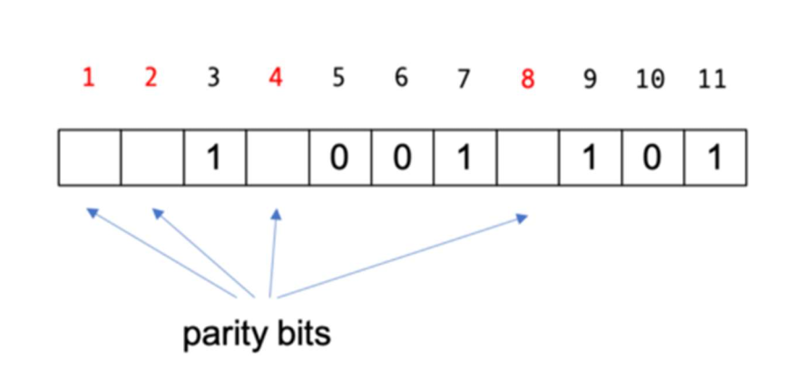
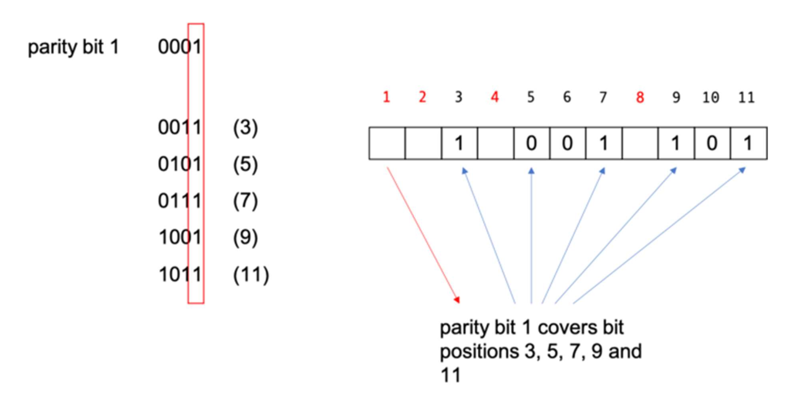
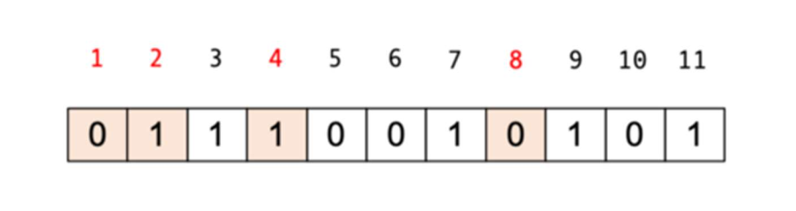
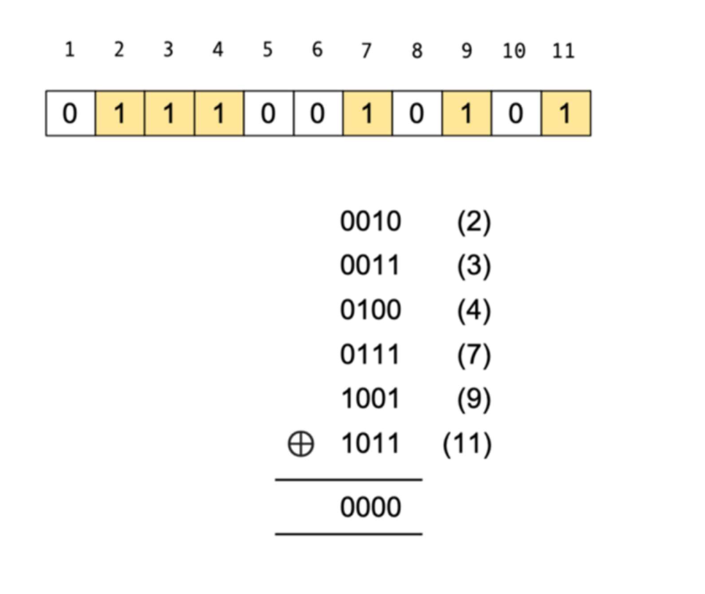
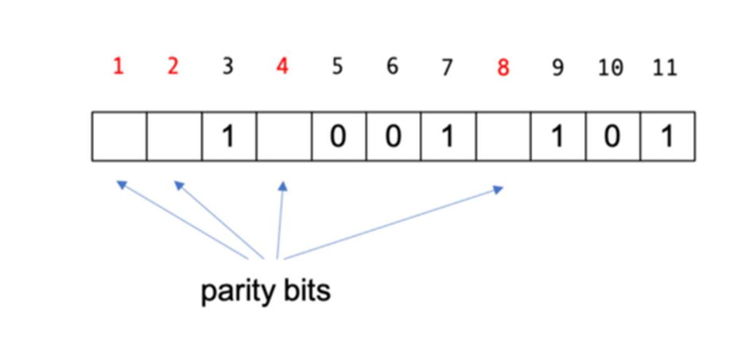
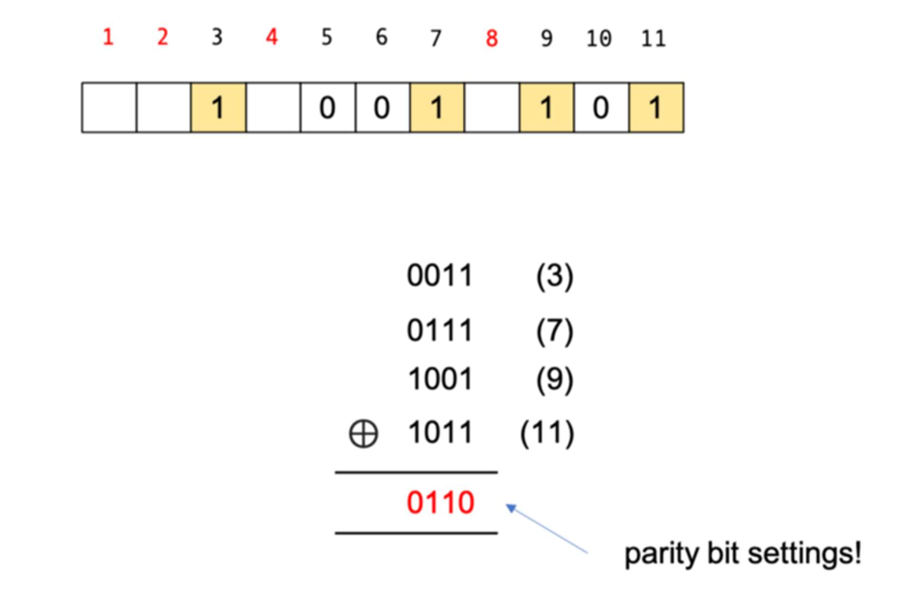
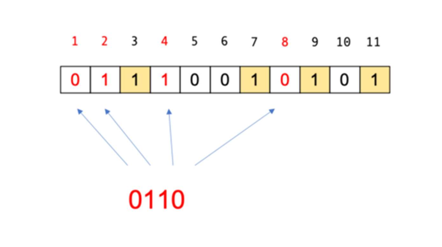
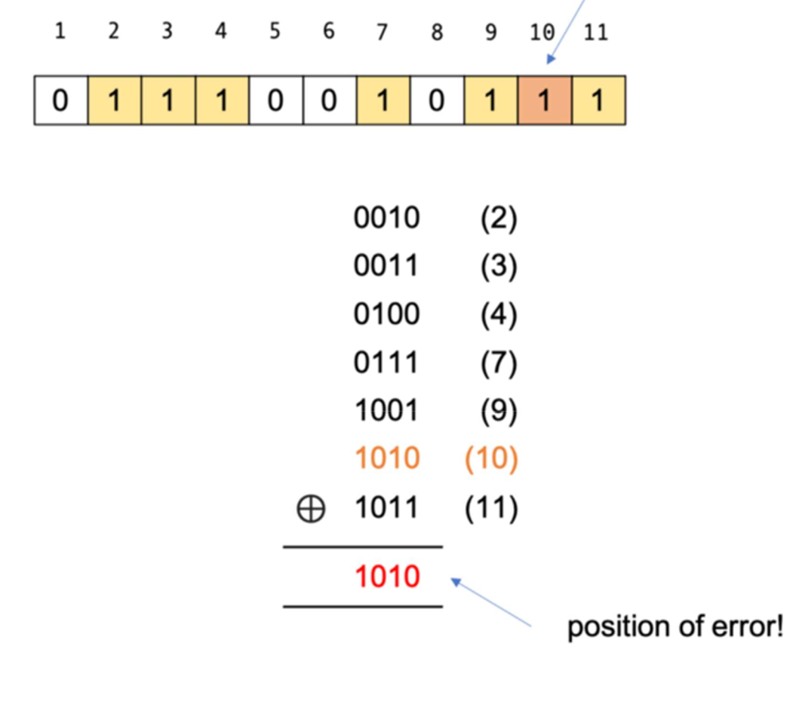
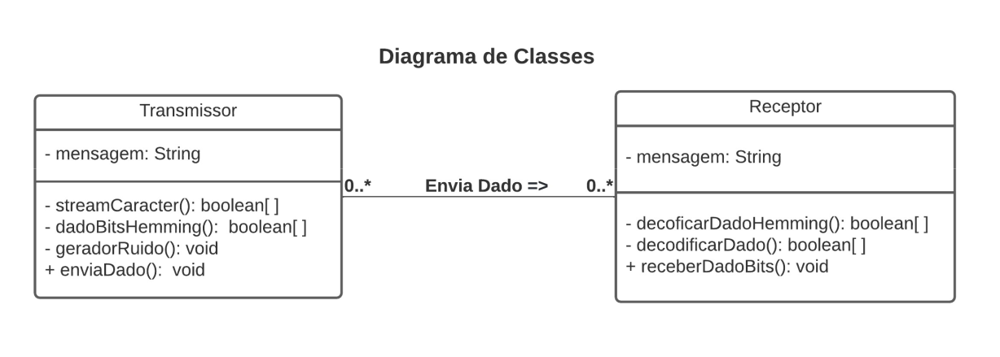

<h1 align="center"> Transmissão de Dados Utilizando Código Hamming </h1>

<h2 id="about">💡&nbsp; Introdução </h2>

No contexto da transmissão de dados entre um transmissor e um receptor, a mensagem transmitida possui possibilidade de chegar ao seu determinado receptor com algum ruído (alteração de alguma das características do sinal transmitido). Dessa forma, surge a necessidade de se ter algum mecanismo de verificação e correção da informação transmitida pelo transmissor. Dito isso, o propósito deste projeto é demonstrar a resolução de tal problemática através da utilização do código de Hamming (código de detecção que permite a detecção deerro de um bit e também a localização do bit errado). 

---

<h2 id="technologies">🛠&nbsp; Código de Hamming – Funcionamento (ICHI.PRO, 2020) </h2>

Explicar o algoritmo é mais fácil com um exemplo. Então, vamos pegar os dados de 7 bits (1001101) que Alice quer enviar para Bob e ver como funciona o código de Hamming.

Para codificar esse pacote de dados, precisamos tomar as posições dos bits com potências de 2 (ou seja, eles têm um único bit 1 na forma binária de sua posição) como bits de paridade, enquanto o resto são bits de dados. Então, os bits de paridade aqui estão em posição de bit 1, 2, 4 e 8, que são em binário 0001 , 0010 , 0100 e 1000 .

Cada bit de paridade cobre posições de bit conforme determinado pela forma binária de sua posição de bit. Por exemplo, para o bit 1, ele cobre todas as posições de bit que têm o conjunto de bits menos significativo, por exemplo, 3 (11), 5 (101), 7, (111), 9 (1001) e 11 (1011). Observe que o último bit significativo é 1.

Em nosso exemplo, a posição do bit 3 é 1, a posição do bit 5 é 0, a posição do bit 7 é 1, a posição do bit 9 é 1 e o bit 11 também é 1. Quando somamos, é 4. Supondo que queremos paridade uniforme (se a paridade par ou ímpar não importa, desde que sejamos consistentes ao codificar e decodificar), o bit de paridade 1 é então definido como 0.

Para o bit de paridade 2, ele cobrirá todas as posições de bit que possuem o segundo bit menos significativo definido. Isso significa que o bit de paridade 2 irá cobrir as posições de bit 3 (0011), 6 (0110), 7 (0111), 10 (1010) e 11 (1011). Se verificarmos essas posições, você pode ver que os respectivos bits são 1, 0, 1, 0, 1, que somados são 3. Para torná-la paridade uniforme, precisaremos tornar o bit de paridade 2 a 1.

Da mesma forma, o bit de paridade 4 cobrirá as posições de bit 5, 6 e 7, que são 0, 0 e 1, portanto, o bit de paridade 4 precisa ser 1. O bit de paridade 8 cobre as posições de bit 9, 10 e 11, que são 1,0 e 1, então o bit de paridade 8 precisa ser 0.

O código final codificado (11,7) é este:

Alice então manda 01110010101 para Bob. Quando Bob recebe esse código, ele precisa decodificá-lo. Para decodificar e determinar se os dados estão corretos, tomamos as formas
binárias das posições de bit que tem seu conjunto de bits (ou seja, é 1) e, em seguida, XOR-lo.

Na verdade, você também pode escolher as posições dos bits que têm seu bit não definido (0), isso realmente não importa. Em qualquer caso, se for 0, significa que não há erro. Parece mágica, mas se você pensar bem, o resultado do XOR é basicamente a paridade dos argumentos.

Na verdade, se olharmos para trás, para o que fizemos antes e vermos como obtivemos os bits de paridade, podemos usar um atalho. Vamos examinar as posições dos bits de dados aqui, antes de definirmos os bits de paridade.

Agora, vamos pegar as posições dos bits que têm seu conjunto de bits e aplicar um XOR a elas. Lembre-se, isso é antes de definirmos os bits de paridade.

Os resultados do XOR são basicamente as configurações dos bits de paridade! Esta é uma maneira rápida de codificar os bits de paridade.

Aqui está o truque da festa. Se houver um erro na mensagem transmitida, quando você decodificar (ou seja, fizer XOR), você obterá a localização do erro! Por exemplo, em vez de 0, o valor na posição do bit 10 é invertido e agora é definido como 1.

Se você agora aplicar o XOR nas posições de bit definidas, em vez de 0, você obterá a posição onde o erro ocorre! Isso ocorre porque todo o resto se cancela durante o XOR, exceto a parte errada!

Se Bob obtiver esse resultado, ele saberá imediatamente a posição do erro e poderá invertê-lo, tornando o código autocorretivo. É assim que o código de Hamming funciona.

---

<h2 id="">👨‍💻&nbsp; Implementação </h2>

O programa foi implementado na linguagem Java, seguindo o paradigma de Orientação a Objetos, possuindo duas classes principais (Receptor e Transmissor), que portam uma associação simples (Transmissor envia dado para Receptor).

Na visão geral do funcionamento do programa, o que ocorre é a transmissão de uma mensagem a partir de um transmissor (dispositivo qualquer), que codifica a mensagem usando o código de Hamming, para um receptor (servidor qualquer), que verifica e, caso necessário,
corrige a mensagem recebida, assim a decodificando.

